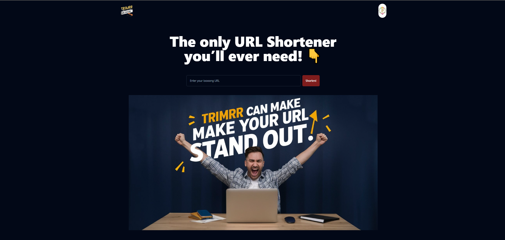

# URL Shortener Project

This project is a URL shortener service that allows users to create shortened links for long URLs.

## Features

- Shorten long URLs to compact, shareable links
- Generate QR codes for shortened links
- Track click statistics for shortened links
- Display location and device data for link clicks

## Screenshots

### Homepage

The homepage advertises the service as "The only URL Shortener you'll ever need!"

### Login/Signup Page

Users can log in to existing accounts or sign up for new ones.

### Main Dashboard

The main dashboard shows existing shortened links, their QR codes, and options to create new links.

### Link Statistics

Detailed statistics are provided for each shortened link, including total clicks, location data, and device information.

## Usage

1. Enter the long URL you wish to shorten
2. (Optional) Customize the shortened link
3. Click "Create" to generate your shortened URL
4. Share your shortened link or use the generated QR code

## Technologies Used

- **React**: A JavaScript library for building user interfaces
- **React Router**: For handling routing in the application
- **Supabase**: A Backend-as-a-Service (BaaS) platform for database and authentication
- **Recharts**: A charting library for React
- **Tailwind CSS**: A utility-first CSS framework
- **Shadcn UI**: A collection of re-usable components built with Tailwind CSS
- **Yup**: A JavaScript schema builder for value parsing and validation
- **UA Parser JS**: A library to detect Browser, Engine, OS, CPU, and Device type/model from User-Agent data
- **React QR Code Logo**: For generating QR codes
- **React Spinners**: For loading animations

## Installation

[Provide installation instructions here]

## Contributing

[Instructions for how others can contribute to the project]

## License

[Specify the license under which this project is released]
